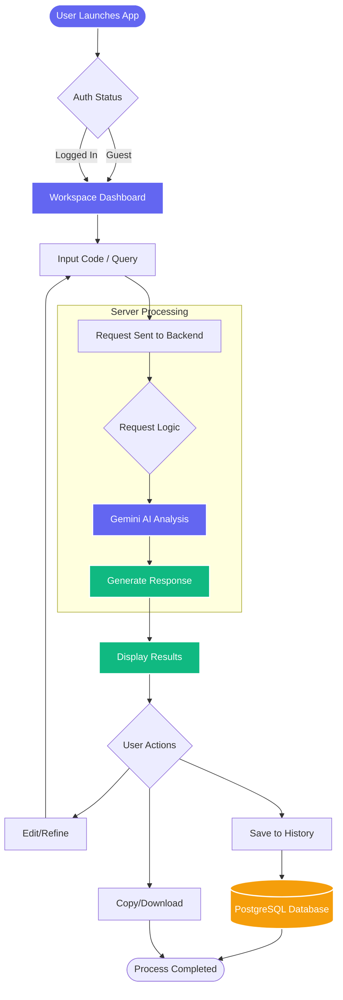
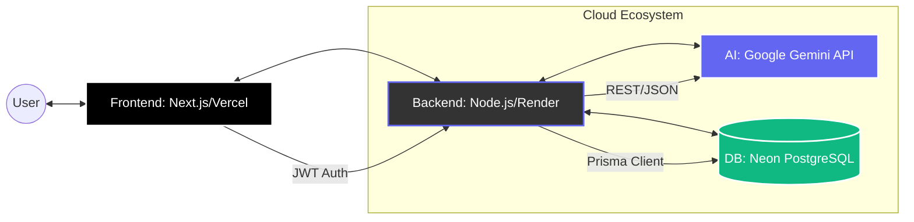

# CodeMentor AI — Project Flow & Architecture

This document outlines the operational flow and system architecture of the **CodeMentor AI** platform.

## 🚀 Application Flow Infographic

---

## 🛠️ Detailed Process Logic

The following diagram breaks down the technical stages of the application, from initial access to data persistence.

---

## 🛠️ System Architecture & Data Flow

This diagram illustrates the technical stack and how data securely moves between components.

### 🔐 Technical Stack Overview

*   **Frontend**: Next.js 14, Tailwind CSS, Framer Motion.
*   **Backend**: Node.js, Express.js.
*   **AI Model**: Google Gemini Pro & Groq (Llama 3).
*   **ORM/Database**: Prisma ORM with Neon PostgreSQL.
*   **Deployment**: Vercel (Frontend) and Render (Backend).
